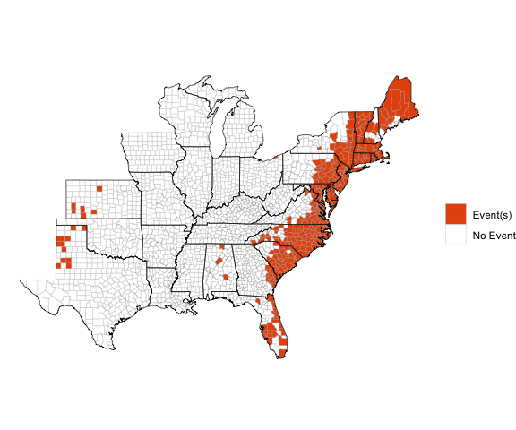

<!-- [](https://travis-ci.org/zailchen/noaastormevents) -->
<!-- README.md is generated from README.Rmd. Please edit that file -->

## Description of package

This package can be used to explore and map data from [NOAA’s Storm
Events Database](https://www.ncdc.noaa.gov/stormevents/). This storm
event database is maintained by NOAA’s National Centers for
Environmental Information and aims to provide information, including
estimates of damage and human health impacts, for severe storm events
that affect the U.S. It has aggregated storm event listings for tornados
since the 1950s and for a broad range of event types (e.g., snow storms,
heat waves, droughts, wildfires, floods) since 1996. This database has
been used either alone or in conjunction with other data for a number of
scientific studies. It is available for downloading at
<https://www.ncdc.noaa.gov/stormevents/ftp.jsp>, with three files (one
with event details, one with fatality details, and with with location
details) available per year.

While the online database does not have a structured API, this package
uses regular expressions to search the listings of available files to
identify the filename for a queried year and download that year’s data
to a user’s R session. The package functions then filter the downloaded
storm event listings based on the dates, locations, event types, and
other search limitations specified by the user. In particular, this
package can be used to identify storm event listings that were close in
location and time to Atlantic basin tropical storm tracks.

The package has two main functions:

- `find_events`: Create a dataframe with event listings by county based
  on user-specified parameters (e.g., date range, specific tropical
  storm, type of event) from the NOAA Storm Events database
- `map_events`: Create a map showing the geographic distribution by
  county of certain features of an events dataframe (e.g., whether or
  not a county had an event, number of events per county, total property
  damage in a county across event listings).

While this package aims to create and map events data by county, some
events are listed in the original database by forecast zone rather than
county. For these observations, the package functions attempts to match
the observation with the appropriate county. However, there are some
events listed by forecast zone that cannot be matched to county, and so
are excluded from results returned by this package. Further, there may
be occasional errors in this matching, so we include a marker in
returned datasets indicating which events were listed by forecast zone
rather than county, to allow further quality control checks by the user
for their specific applications of the package.

The `noaastormevents` package includes options that allow users to find
events based on proximity to a tropical storm. To use this
functionality, the user must have the `hurricaneexposuredata` package,
available from a drat repository, installed locally. This package can be
installed by running:

``` r
library(drat)
addRepo("geanders")
install.packages("hurricaneexposuredata")
```

It is important for users to note that there are limitations to this
storm events database. In particular, listings can be somewhat
subjective. A lack of event listing in the database should not be
considered definitive proof that storm conditions did not exist at a
location at a certain time. Further, the database has changed over time
in terms of which types of events are included. R users should review
the Storm Event Database’s documentation, which is available at [the
database’s website](https://www.ncdc.noaa.gov/stormevents/), to be sure
they understand how to use and interpret event listings from the
database. Further, the `noaastormevents` package includes a “Details”
vignette with more details on this storm events data and how it is
processed by functions in this package.

## Creating storm events datasets

The package has two main functions. First, the `find_events` function
can be used to create a dataframe with all storm event listings within a
specified time frame. For example, the following code creates a
dataframe with all events from the NOAA Storm Events Database listed as
beginning between September 14 and 18, 1999 (a time window relevant for
Hurricane Floyd, which caused extensive damage, especially from
flooding):

``` r
sept_1999_events <- find_events(date_range = c("1999-09-14", "1999-09-18"))
head(sept_1999_events)
#> # A tibble: 6 × 14
#>   begin_date end_date   state  cz_type cz_name event_type source injuries_direct
#>   <date>     <date>     <chr>  <chr>   <chr>   <chr>      <chr>            <int>
#> 1 1999-09-14 1999-09-14 Flori… C       Duval   Thunderst… TRAIN…               0
#> 2 1999-09-14 1999-09-14 Flori… C       St. Jo… Thunderst… TRAIN…               0
#> 3 1999-09-14 1999-09-14 Arizo… C       Marico… Hail       OFFIC…               0
#> 4 1999-09-14 1999-09-14 Arizo… C       Marico… Hail       TRAIN…               0
#> 5 1999-09-14 1999-09-14 Arizo… C       Pinal   Thunderst… NEWSP…               0
#> 6 1999-09-14 1999-09-14 Arizo… C       Marico… Lightning  EMERG…               1
#> # ℹ 6 more variables: injuries_indirect <int>, deaths_direct <int>,
#> #   deaths_indirect <int>, damage_property <dbl>, damage_crops <dbl>,
#> #   fips <dbl>
```

The code call returns a data frame with a subset of data from the Storm
Events Database for 1999. Each event listing with a start date between
September 14 and 18 is included. The data frame has the following
columns:

- `begin_date`: The date the event began
- `end_date`: The date the event ended
- `state`: The state in which the event occurred
- `cz_type`: Whether the event was listed by county or by forecast zone
  (Where possible, events that are listed by forecast zone are linked to
  the appropriate county FIPS code and therefore not excluded from this
  returned dataframe. However, this column is included to allow users to
  perform quality control on events listed by forecast zone (`CZ_TYPE`
  of “Z”).)
- `cz_name`: The name of the county (or other area name) in which the
  event occurred.
- `event_type`: Event type (e.g., “Flood”, “Lightning”, “Tornado”,
  “Wildfire”). See [the NOAA Storm Events
  documentation](https://www.ncdc.noaa.gov/stormevents/pd01016005curr.pdf)
  for definitions of these event types
- `source`: The source of the storm event listing (e.g., trained
  spotter, emergency manager, general public, law enforcement)
- `injuries_direct`, `injuries_indirect`, `deaths_direct`,
  `deaths_indirect`, `damage_property`, `damage_crops`: Estimates of
  damage from the event to human health, property, and crops. For
  damages, initial values in the database (e.g., `"5K"`) have been
  converted where possible to numeric values (e.g., `5000`). See the
  “Details” vignette for more details on this process.
- `fips`: Five-digit county (Federal Information Processing Standard)
  FIPS code. This code uniquely identifies each U.S. county. If the
  event was reported by forecast zone (`cz_type` of `Z`), code within
  the package has used regular expressions to try to correctly match the
  area name to a county FIPS (see the “Details” vignette for more
  details on this process).

There are several ways that you can customize the use of the
`find_events` function. For more details, see the article on “Finding
Events”.

## Mapping storm events

The package also has a function, `map_events`, for mapping several
different features from the storm event dataframes returned by
`find_events`. This function is meant to provide reasonable defaults for
many maps a user might want to create with this data, but in some cases
might not provide the exact map a user would like to create. In that
case, we recommend the user try the `choroplethr` package, which can be
used to map US county data as long as the data includes county FIPS
codes, as the dataframes returned by `find_events` do.

The `map_events` function allows you to create maps of several features
of the dataframe returned by `find_events`:

- “any events”: Map whether or not a county had any listed events
- “number of events”: Map the number of events listed for a county
- “direct deaths”: Map the total count of direct deaths across all
  events listed for a county
- “direct injuries”: Map the total count of direct injuries across all
  events listed for a county
- “indirect deaths”: Map the total count of direct deaths across all
  events listed for a county
- “indirect injuries”: Map the total count of direct injuries across all
  events listed for a county
- “property damage”: Map the total property damage across all events
  listed for a county
- “crop damage”: Map the total crop damage across all events listed for
  a county

The maps for property and crop damage use a logarithmic scale, while
others use an untransformed scale. Listings for all events within a
county in the input dataframe are summed to create county-level values
to map. While the function allows mapping indirect injuries and deaths,
in practice is seems these are rarely listed in recent Storm Events
data, so these may not create informative maps.

The `map_events` function inputs a dataframe as created by
`find_events`. For example, to map which counties had events listed that
started between September 14 and 18, 2009, you can run:

``` r
event_data <- find_events(date_range = c("1999-09-14", "1999-09-18"))
map_events(event_data)
```

<!-- -->

There are many ways you can customize the use of this function. For more
details on how to use the `map_events` function, see the article on
“Finding Events”.

## Find out more

There are many more details describing how this package works, as well
as details on the Storm Events data, in the “Details” article.
