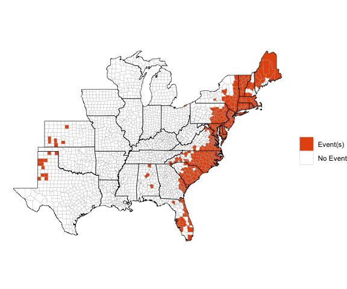
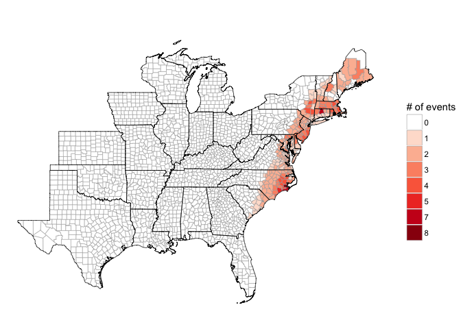
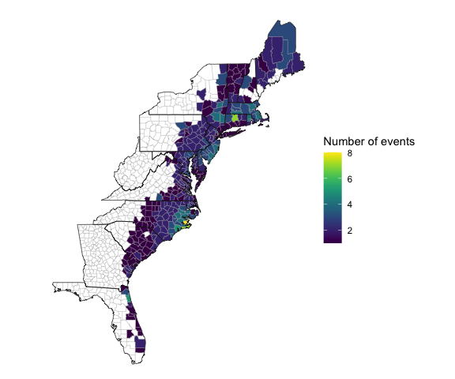
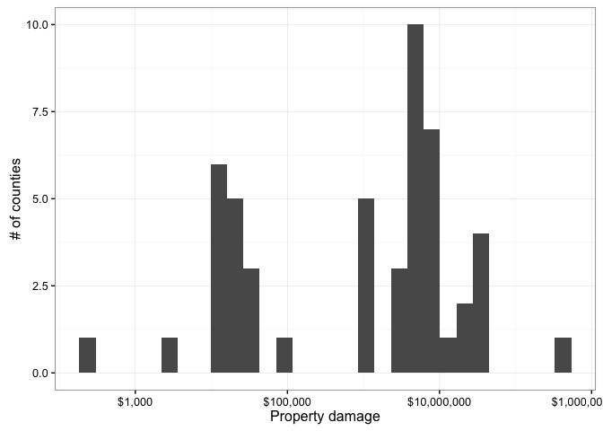
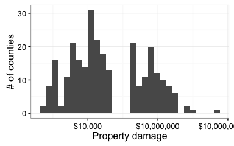
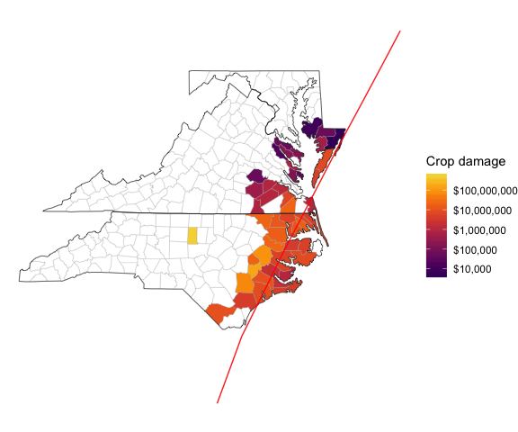

[](https://travis-ci.org/zailchen/noaastormevents)

<!-- README.md is generated from README.Rmd. Please edit that file -->
Description of package
----------------------

This package can be used to explore and map data from [NOAA's Storm Events Database](https://www.ncdc.noaa.gov/stormevents/). This storm event database is maintained by NOAA's National Centers for Environmental Information and aims to provide information, including estimates of damage and human health impacts, for severe storm events that affect the U.S. It has aggregated storm event lisings for tornados since the 1950s and for a broad range of event types (e.g., snow storms, heat waves, droughts, wildfires, floods) since 1996. This database has been used either alone or in conjunction with other data for a number of scientific studies. It is available for downloading at <https://www.ncdc.noaa.gov/stormevents/ftp.jsp>, with three files (one with event details, one with fatality details, and with with location details) available per year.

While the online database does not have a structured API, this package uses regular expressions to search the listings of available files to identify the filename for a queried year and download that year's data to a user's R session. The package functions then filter the downloaded storm event listings based to the dates, locations, event types, and other search limitations specified by the user. In particular, this package can be used to identify storm event listings that were close in location and time to Atlantic basin tropical storm tracks.

The package has two main functions:

-   `find_events`: Create a dataframe with event listings by county based on user-specified parameters (e.g., date range, specific tropical storm, type of event) from the NOAA Storm Events database
-   `map_events`: Create a map showing the geographic distribution by county of certain features of an events dataframe (e.g., whether or not a county had an event, number of events per county, total property damage in a county across event listings).

While this package aims to create and map events data by county, some events are listed in the original database by forecast zone rather than county. For these observations, the package functions attempts to match the observation with the appropriate county. However, there are some events listed by forecast zone that cannot be matched to county, and so are excluded from results returned by this package. Further, there may be occasional errors in this matching, so we include a marker returned datasets indicating which events were listed by forecast zone rather than county, to allow further quality control checks by the user for his or her specific applications of the package.

The `noaastormevents` package includes options that allow users to find events based on proximity to a tropical storm. To use this functionality, the user must have the `hurricaneexposuredata` package, available from a drat repository, installed locally. This package can be installed by running:

``` r
library(drat)
addRepo("geanders")
install.packages("hurricaneexposuredata")
```

It is important for users to note that there are limitations to this storm events database. In particular, listings can be somewhat subjective. A lack of event listing in the database should not be considered definitive proof that storm conditions did not exist at a location at a certain time. Further, the database has changed over time in terms of which types of events are included. R users should review the Storm Event Database's documentation, which is available at [the database's website](https://www.ncdc.noaa.gov/stormevents/), to be sure they understand how to use and interpret event listings from the database. Further, the `noaastormevents` package includes a "Details" vignette with more details on this storm events data and how it is processed by functions in this package.

Creating storm events datasets
------------------------------

The package has two main functions. First, the `find_events` function can be used to create a dataframe with all storm event listings within a specified time frame. For example, the following code creates a dataframe with all events from the NOAA Storm Events Database listed as beginning between September 14 and 18, 1999 (a time window relevant for Hurricane Floyd, which caused extensive damage, especially from flooding):

``` r
sept_1999_events <- find_events(date_range = c("1999-09-14", "1999-09-18"))
head(sept_1999_events)
#> # A tibble: 6 x 14
#>   begin_date   end_date   state cz_type   cz_name        event_type
#>       <date>     <date>   <chr>   <chr>     <chr>             <chr>
#> 1 1999-09-14 1999-09-14 Florida       C     Duval Thunderstorm Wind
#> 2 1999-09-14 1999-09-14 Florida       C St. Johns Thunderstorm Wind
#> 3 1999-09-14 1999-09-14 Arizona       C  Maricopa              Hail
#> 4 1999-09-14 1999-09-14 Arizona       C  Maricopa              Hail
#> 5 1999-09-14 1999-09-14 Arizona       C     Pinal Thunderstorm Wind
#> 6 1999-09-14 1999-09-14 Arizona       C  Maricopa         Lightning
#> # ... with 8 more variables: source <chr>, injuries_direct <int>,
#> #   injuries_indirect <int>, deaths_direct <int>, deaths_indirect <int>,
#> #   damage_property <dbl>, damage_crops <dbl>, fips <dbl>
```

The code call returns a data frame with a subset of data from the Storm Events Database for 1999. Each event listing with a start data between September 14 and 18 is included. The data frame has the following columns:

-   `begin_date`: The date the event began
-   `end_date`: The date the event ended
-   `state`: The state in which the event occurred
-   `cz_type`: Whether the event was listed by county or by forecast zone (Where possible, events that are listed by forecast zone are linked to the appropriate county FIPS code and therefore not excluded from this returned dataframe. However, this column is included to allow users to perform quality control on events listed by forecast zone (`CZ_TYPE` of "Z").)
-   `cz_name`: The name of the county (or other area name) in which the event occurred.
-   `event_type`: Event type (e.g., "Flood", "Lightning", "Tornado", "Wildfire"). See [the NOAA Storm Events documentation](https://www.ncdc.noaa.gov/stormevents/pd01016005curr.pdf) for definitions of these event types
-   `source`: The source of the storm event listing (e.g., trained spotter, emergency manager, general public, law enforcement)
-   `injuries_direct`, `injuries_indirect`, `deaths_direct`, `deaths_indirect`, `damage_property`, `damage_crops`: Estimates of damage from the event to human health, property, and crops. For damages, initial values in the database (e.g., `"5K"`) have been converted where possible to numeric values (e.g., `5000`). See the "Details" vignette for more details on this process.
-   `fips`: Five-digit county (Federal Information Processing Standard) FIPS code. This code uniquely identifies each U.S. county. If the event was reported by forecast zone (`cz_type` of `Z`), code within the package has used regular expressions to try to correctly match the area name to a county FIPS (see the "Details" vignette for more details on this process).

In some cases, a user may wish to identify all storm events listings that were close in time and place to a tropical storm track, which can be done using the `storm` option of the `find_events` function. To do this, the package draws on data and functions in the packages `hurricaneexposure` (available on CRAN) and `hurricaneexposuredata` (available through a drat repository) to match storm event listings against tropical storm "best tracks" data through the `hurricaneexposuredata` and `hurricaneexposure` packages.

Event listings are pulled for all events that occured within a five-day window of the day the storm was closest to each county and that were in counties within a user-specified distance of the storm track. For example, to create a dataset with all event listings for counties within 300 kilometers (`dist_limit` option) of the path of Hurricane Floyd (`storm = "Floyd-1999"`) for a five-day window of the storm's closest approach to each county, the user can run:

``` r
floyd_events <- find_events(storm = "Floyd-1999", dist_limit = 300)
head(floyd_events)
#> # A tibble: 6 x 15
#>   begin_date   end_date          state cz_type            cz_name
#>       <date>     <date>          <chr>   <chr>              <chr>
#> 1 1999-09-13 1999-09-14        Florida       Z Coastal Palm Beach
#> 2 1999-09-13 1999-09-14        Florida       Z    Coastal Broward
#> 3 1999-09-14 1999-09-14        Florida       C              Duval
#> 4 1999-09-14 1999-09-14        Florida       C          St. Johns
#> 5 1999-09-14 1999-09-14        Florida       C         Palm Beach
#> 6 1999-09-14 1999-09-14 North Carolina       C             Martin
#> # ... with 10 more variables: event_type <chr>, source <chr>,
#> #   injuries_direct <int>, injuries_indirect <int>, deaths_direct <int>,
#> #   deaths_indirect <int>, damage_property <dbl>, damage_crops <dbl>,
#> #   fips <dbl>, storm_id <chr>
```

Note that the storm ID includes a storm name ("Floyd") and year ("1999"). Both must be specified, as storm names are not retired until they are used for a very severe storm. This functionality will only work for storms included in the `hurricaneexposuredata` package. These currently include:

| year | storms                                                                      |
|:-----|:----------------------------------------------------------------------------|
| 1988 | Alberto, Beryl, Chris, Florence, Gilbert, Keith                             |
| 1989 | Allison, Chantal, Hugo, Jerry                                               |
| 1990 | Bertha, Marco                                                               |
| 1991 | Ana, Bob, Fabian, Notnamed                                                  |
| 1992 | Andrew, Danielle, Earl                                                      |
| 1993 | Arlene, Emily                                                               |
| 1994 | Alberto, Beryl, Gordon                                                      |
| 1995 | Allison, Dean, Erin, Gabrielle, Jerry, Opal                                 |
| 1996 | Arthur, Bertha, Edouard, Fran, Josephine                                    |
| 1997 | Subtrop, Ana, Danny                                                         |
| 1998 | Bonnie, Charley, Earl, Frances, Georges, Hermine, Mitch                     |
| 1999 | Bret, Dennis, Floyd, Harvey, Irene                                          |
| 2000 | Beryl, Gordon, Helene, Leslie                                               |
| 2001 | Allison, Barry, Gabrielle, Michelle                                         |
| 2002 | Arthur, Bertha, Cristobal, Edouard, Fay, Gustav, Hanna, Isidore, Kyle, Lili |
| 2003 | Bill, Claudette, Erika, Grace, Henri, Isabel                                |
| 2004 | Alex, Bonnie, Charley, Frances, Gaston, Hermine, Ivan, Jeanne, Matthew      |
| 2005 | Arlene, Cindy, Dennis, Emily, Katrina, Ophelia, Rita, Tammy, Wilma          |
| 2006 | Alberto, Beryl, Chris, Ernesto                                              |
| 2007 | Andrea, Barry, Erin, Gabrielle, Humberto, Noel                              |
| 2008 | Cristobal, Dolly, Edouard, Fay, Gustav, Hanna, Ike, Kyle, Paloma            |
| 2009 | Claudette, Ida                                                              |
| 2010 | Alex, Bonnie, Earl, Hermine, Nicole, Paula                                  |
| 2011 | Bret, Don, Emily, Irene, Lee                                                |
| 2012 | Alberto, Beryl, Debby, Isaac, Sandy                                         |
| 2013 | Andrea, Dorian, Karen                                                       |
| 2014 | Arthur                                                                      |
| 2015 | Ana, Bill, Claudette                                                        |

Once `find_events` has been used to create a dataset of storm event listings, the dataset can be explored. The user can do things like determine the number of events of each type that occurred near in time and location to a storm's track. For example, here is a summary of numbers of different types of events for Hurricane Floyd, created using `dplyr` tools:

``` r
library(dplyr)
floyd_events %>%
  group_by(event_type) %>%
  summarize(n = n()) %>%
  arrange(desc(n)) %>%
  knitr::kable(col.names = c("Event type", "Number of events"),
               caption = "NOAA Storm Events within 200 km and within a 5-day window of Hurricane Floyd.")
```

| Event type          |  Number of events|
|:--------------------|-----------------:|
| Flash Flood         |               232|
| High Wind           |               156|
| Hurricane (Typhoon) |               116|
| Heavy Rain          |                28|
| Strong Wind         |                21|
| Thunderstorm Wind   |                19|
| Tornado             |                18|
| Tropical Storm      |                16|
| Flood               |                14|
| Coastal Flood       |                10|
| Storm Surge/Tide    |                 5|
| Funnel Cloud        |                 2|
| Waterspout          |                 1|

Similarly, you could create a summary with the states in which the most events were listed and give the number and type of events in each of those counties:

``` r
floyd_events %>%
  group_by(state, event_type) %>%
  summarize(n = n()) %>%
  ungroup() %>%
  arrange(state, desc(n)) %>%
  mutate(event_type = paste0(event_type, " (", n, ")")) %>%
  group_by(state) %>%
  summarize(Total = sum(n),
            Events = paste(event_type, collapse = ", ")) %>%
  ungroup() %>%
  arrange(desc(Total)) %>%
  knitr::kable()
```

| state                |  Total| Events                                                                                                                           |
|:---------------------|------:|:---------------------------------------------------------------------------------------------------------------------------------|
| North Carolina       |    144| Flash Flood (58), Hurricane (Typhoon) (57), Tornado (17), High Wind (8), Funnel Cloud (2), Thunderstorm Wind (1), Waterspout (1) |
| Virginia             |     97| Flash Flood (57), High Wind (16), Hurricane (Typhoon) (16), Tropical Storm (5), Flood (2), Heavy Rain (1)                        |
| Pennsylvania         |     58| Flash Flood (28), High Wind (27), Coastal Flood (3)                                                                              |
| New York             |     52| High Wind (27), Flash Flood (24), Flood (1)                                                                                      |
| New Jersey           |     51| Flash Flood (18), High Wind (18), Coastal Flood (5), Tropical Storm (4), Heavy Rain (3), Hurricane (Typhoon) (3)                 |
| Maryland             |     43| Flash Flood (15), High Wind (11), Tropical Storm (6), Storm Surge/Tide (5), Hurricane (Typhoon) (4), Heavy Rain (2)              |
| Massachusetts        |     37| Strong Wind (12), Heavy Rain (11), High Wind (11), Flash Flood (2), Flood (1)                                                    |
| South Carolina       |     33| Thunderstorm Wind (13), Hurricane (Typhoon) (11), High Wind (5), Flash Flood (4)                                                 |
| Maine                |     23| High Wind (12), Flash Flood (6), Flood (5)                                                                                       |
| Florida              |     20| Hurricane (Typhoon) (12), Thunderstorm Wind (5), Flash Flood (2), Tornado (1)                                                    |
| Connecticut          |     18| Flash Flood (7), Heavy Rain (4), Strong Wind (3), Flood (2), High Wind (2)                                                       |
| Vermont              |     17| High Wind (14), Flash Flood (3)                                                                                                  |
| Rhode Island         |     14| Heavy Rain (5), Strong Wind (5), Flash Flood (2), High Wind (2)                                                                  |
| Georgia              |     13| Hurricane (Typhoon) (13)                                                                                                         |
| Delaware             |      8| Flash Flood (3), High Wind (3), Coastal Flood (2)                                                                                |
| New Hampshire        |      8| Flood (3), Flash Flood (2), Heavy Rain (2), Strong Wind (1)                                                                      |
| District Of Columbia |      2| Flash Flood (1), Tropical Storm (1)                                                                                              |

Mapping storm events
--------------------

The package also has a function, `map_events`, for mapping several different features from the storm event dataframes returned by `find_events`. This function is meant to provide reasonable defaults for many maps a user might want to create with this data, but in some cases might not provide the exact map a user would like to create. In that case, we recommend the user try the `choroplethr` package, which can be used to map US county data as long as the data includes county FIPS codes, as the dataframes returned by `find_events` do.

The `map_events` function allows you to create maps of several features of the dataframe returned by `find_events`:

-   "any events": Map whether or not a county had any listed events
-   "number of events": Map the number of events listed for a county
-   "direct deaths": Map the total count of direct deaths across all events listed for a county
-   "direct injuries": Map the total count of direct injuries across all events listed for a county
-   "indirect deaths": Map the total count of direct deaths across all events listed for a county
-   "indirect injuries": Map the total count of direct injuries across all events listed for a county
-   "property damage": Map the total property damage across all events listed for a county
-   "crop damage": Map the total crop damage across all events listed for a county

The maps for property and crop damage use a logarithmic scale, while others use an untransformed scale. Listings for all events within a county in the input dataframe are summed to create county-level values to map. While the function allows mapping indirect injuries and deaths, in practice is seems these are rarely listed in recent Storm Events data, so these may not create informative maps.

The `map_events` function inputs a dataframe as created by `find_events`. For example, which counties had events listed that started between September 14 and 18, 2009, you can run:

``` r
event_data <- find_events(date_range = c("1999-09-14", "1999-09-18"))
map_events(event_data)
```



Because the first argument of `map_events` is a dataframe, you can also use the pipe operator (`%>%`) to pipe the results of a call to `find_events` directly into `map_events`, as shown in the next example.

The `map_events` function includes a `states` option, to allow the user to limit the map to a subset of states (only states in the continental US can be included). This option also allows the inputs of "east" (the default, maps only states in the eastern half of the United States) and "all" (maps all states in the continental US). To create a map of all events within 300 km of the track of Hurricane Floyd with start dates in a five-day window of the storm's closest date to each county, and to map all continental states, you can run:

``` r
floyd_events <- find_events(storm = "Floyd-1999", dist_limit = 300) 
floyd_events %>% 
  map_events(states = "all")
```



If you instead would like to limit the map to states along the East Coast and plot the number of reported events per county, you could instead run:

``` r
floyd_events %>% 
  map_events(plot_type = "number of events",
             states = c("florida", "georgia", "south carolina", "north carolina",
                        "virginia", "maryland", "delaware", "pennsylvania",
                        "new jersey", "new york", "connecticut", "rhode island",
                        "massachusetts", "vermont", "new hampshire", "maine", 
                        "west virginia"))
```



The maps for crop and property damage use a logarithmic scale, which typically shows differences in these measurements better than an untransformed scale. For example, here is the call and resulting map to map crop damage associated with Hurricane Floyd in North Carolina, Virginia, and Maryland:

``` r
floyd_events %>%   
  map_events(plot_type = "crop damage",
             states = c("north carolina", "virginia", "maryland"))
```



Property damage can be mapped in a similar way:

``` r
floyd_events %>% 
  map_events(plot_type = "property damage",
             states = c("florida", "georgia", "south carolina", "north carolina",
                        "virginia", "maryland", "delaware", "pennsylvania",
                        "new jersey", "new york", "connecticut", "rhode island",
                        "massachusetts", "vermont", "new hampshire", "maine", 
                        "west virginia"))
```



The track of a tropical storm can be added to a map by specifying the name of the storm with the `storm` argument and setting `add_tracks` to `TRUE`. For example, the track of Hurricane Floyd can be added to a map of crop damage in North Carolina, Virginia, and Maryland from the example dataframe with the call:

``` r
floyd_events %>%   
  map_events(plot_type = "crop damage",
             states = c("north carolina", "virginia", "maryland"),
             storm = "Floyd-1999", add_tracks = TRUE)
```



Find out more
-------------

There are many more details describing how this package works, as well as details on the Storm Events data, in the "Details" vignette that also comes with this package.
