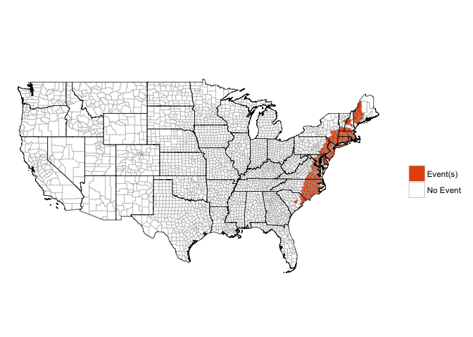

<!-- README.md is generated from README.Rmd. Please edit that file -->
Loading the package
-------------------

The package currently exists in [a development version](https://github.com/zailchen/noaastormevents) on GitHub. You can use the following code to load it:

``` r
library(devtools)
install_github("zailchen/noaastormevents")
library(noaastormevents)
```

As a caveat, however, this package is in early development and relies on other packages that are in development on GitHub, so it may take some doing to get the package set up at the moment.

Simple example
--------------

This package can be used to explore and map data from [NOAA's Storm Events Database](https://www.ncdc.noaa.gov/stormevents/). We are currently developing the package using only data from a single year, 1999.

The storm has a number of functions for mapping different data points from this database. For example, the `map_events` function allows you to map all events in the database with a starting date within a specified range. It also has some options specific to tropical storm research, including mapping only events with tropical storm-related tags or only events that happened in counties within a certain distance of the track of a specific tropical storm.

Here are some examples:

Mapping all counties that had at least one event over a date range:

``` r
map_events(date_range = c("1999-09-14", "1999-09-18"))
```


Creating a dataframe of all events within a date range:

``` r
oct_1999_events <- find_events(date_range = c("1999-09-14", "1999-09-18"))
head(oct_1999_events)
#> # A tibble: 6 × 5
#>   begin_date   end_date  fips CZ_TYPE        type
#>       <date>     <date> <chr>   <chr>       <chr>
#> 1 1999-09-16 1999-09-17 25011       C  Heavy Rain
#> 2 1999-09-16 1999-09-17 25001       C  Heavy Rain
#> 3 1999-09-16 1999-09-17 25015       C  Heavy Rain
#> 4 1999-09-17 1999-09-17 99113       C       Flood
#> 5 1999-09-18 1999-09-18 12081       C  Waterspout
#> 6 1999-09-16 1999-09-16 24025       C Flash Flood
```

Creating a dataframe of all events within a certain time and distance from a hurricane track:

``` r
floyd_events <- find_events(storm = "Floyd-1999", dist_limit = 200)
head(floyd_events)
#> # A tibble: 6 × 5
#>   begin_date   end_date  fips CZ_TYPE        type
#>       <date>     <date> <chr>   <chr>       <chr>
#> 1 1999-09-16 1999-09-17 25011       C  Heavy Rain
#> 2 1999-09-16 1999-09-17 25001       C  Heavy Rain
#> 3 1999-09-16 1999-09-17 25015       C  Heavy Rain
#> 4 1999-09-16 1999-09-16 24025       C Flash Flood
#> 5 1999-09-16 1999-09-16 24005       C Flash Flood
#> 6 1999-09-16 1999-09-16 24510       C Flash Flood
```

Here is an example summary of this data:

``` r
floyd_events %>%
  group_by(type) %>%
  summarize(n = n()) %>%
  arrange(desc(n)) %>%
  knitr::kable(colnames = c("Event type", "Number of events"),
               caption = "NOAA Storm Events within 200 km and [x] days of Hurricane Floyd.")
```

| type              |    n|
|:------------------|----:|
| Flash Flood       |  207|
| Heavy Rain        |   26|
| Tornado           |   17|
| Storm Surge/Tide  |    5|
| Funnel Cloud      |    2|
| Thunderstorm Wind |    2|
| Waterspout        |    1|

Here is another example summary:

``` r
floyd_events %>%
  group_by(fips) %>%
  summarize(n = n(),
            events = paste(type, collapse = ", ")) %>%
  arrange(desc(n)) %>%
  slice(1:10) %>%
  knitr::kable()
```

| fips  |    n| events                                                                     |
|:------|----:|:---------------------------------------------------------------------------|
| 37137 |    7| Flash Flood, Tornado, Tornado, Funnel Cloud, Tornado, Tornado, Flash Flood |
| 37031 |    6| Flash Flood, Tornado, Tornado, Flash Flood, Tornado, Thunderstorm Wind     |
| 09003 |    4| Flash Flood, Flash Flood, Heavy Rain, Flash Flood                          |
| 37133 |    4| Flash Flood, Flash Flood, Funnel Cloud, Tornado                            |
| 37013 |    3| Flash Flood, Waterspout, Flash Flood                                       |
| 37049 |    3| Flash Flood, Flash Flood, Tornado                                          |
| 37117 |    3| Flash Flood, Flash Flood, Flash Flood                                      |
| 37129 |    3| Tornado, Tornado, Flash Flood                                              |
| 37147 |    3| Flash Flood, Tornado, Flash Flood                                          |
| 37187 |    3| Flash Flood, Flash Flood, Tornado                                          |

Mapping any county with at least one tropical storm-related event, not restricting to only the eastern half of the country:

``` r
map_events(storm = "Floyd-1999", dist_limit = 200,
           east_only = FALSE, ts_only = TRUE)
```



Mapping the number of events in each county within a certain date range:

``` r
map_events(storm = "Floyd-1999", dist_limit = 200,
           plot_type = "number of events")
```


Mapping the number of events, but only counting counties that were within 100 kilometers of the track of Hurricane Floyd in 1999, with the hurricane's track added to the plot:

``` r
map_events(storm = "Floyd-1999", dist_limit = 100, 
           add_tracks = TRUE, plot_type = "number of events")
```


Mapping the number of all events that happened under the influence of Hurricane Floyd in 1999, with the hurricane's track added to the plot::

``` r
map_events(storm = "Floyd-1999", dist_limit = 100, add_tracks = TRUE,
           plot_type = "number of events")
```


Details of how the package works
--------------------------------

This package pulls data posted online by the National Centers for Environmental Information (NCEI; formally, the National Climatic Data Center \[NCDC\]). The NCEI currently includes comma-separated files covering different elements of the Storm Events database, with separate files for each year, which are available [here](http://www1.ncdc.noaa.gov/pub/data/swdi/stormevents/csvfiles/).

For each year, there are three file types:

-   `"details"`
-   `"fatalities"`
-   `"locations"`

The file names all follow a consistent format (anything in square brackets is replaced by its value in each file name):

    StormEvents_[file type]-ftp_v[version number]_d[storm year]_c[date file created].csv.gz

More details on these file naming conventions are available from NCEI through a [README file](http://www1.ncdc.noaa.gov/pub/data/swdi/stormevents/csvfiles/README).

Because these file names include the date the file was created, these file names can change with time, and we don't know *a priori* what the name of the file for each year will be. However, if we have a list of available file names, it is possible to determine which corresponds to which year, by matching the year of data you'd like to the year within the `_d[storm year]_` part of the file name.

One function in the `noaastormevents` package, `find_file_name`, uses the `readHTMLTable` function from the `XML` package to read all the file names from the online repository of files and, from this list, identify the appropriate file for the year requested. For example, to determine the "details" file name for 1999, you can run:

``` r
find_file_name(year = 1999)
#> [1] "StormEvents_details-ftp_v1.0_d1999_c20160223.csv.gz"
```

While the default is to find the name of the "details" file type for a year, you can also use the `file_type` argument to pull any of the three file types. For example, to find out the name of the "fatalities" file for 1999, you could run:

``` r
find_file_name(year = 1999, file_type = "fatalities")
#> [1] "StormEvents_fatalities-ftp_v1.0_d1999_c20160223.csv.gz"
```

Files are compressed using gzip compression.
