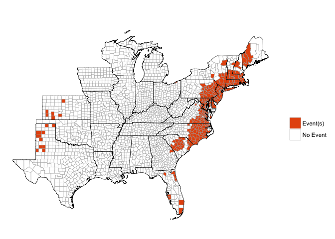

<!-- README.md is generated from README.Rmd. Please edit that file -->
Loading the package
-------------------

The package currently exists in [a development version](https://github.com/zailchen/noaastormevents) on GitHub. You can use the following code to load it:

``` r
library(devtools)
install_github("zailchen/noaastormevents")
library(noaastormevents)
```

As a caveat, however, this package is in early development and relies on other packages that are in development on GitHub, so it may take some doing to get the package set up at the moment.

Simple example
--------------

This package can be used to explore and map data from [NOAA's Storm Events Database](https://www.ncdc.noaa.gov/stormevents/). We are currently developing the package using only data from a single year, 1999.

The storm has a number of functions for mapping different data points from this database. For example, the `map_events` function allows you to map all events in the database with a starting date within a specified range. It also has some options specific to tropical storm research, including mapping only events with tropical storm-related tags or only events that happened in counties within a certain distance of the track of a specific tropical storm.

Here are some examples:

Mapping all counties that had at least one event over a date range:

``` r
map_events(date_range = c("1999-09-14", "1999-09-18"))
#> Joining, by = c("BEGIN_YEARMONTH", "BEGIN_DAY", "END_YEARMONTH", "END_DAY", "state_county_name", "CZ_TYPE", "type", "fips")
```



Creating a dataframe of all events within a date range:

``` r
oct_1999_events <- find_events(date_range = c("1999-09-14", "1999-09-18"))
#> Joining, by = c("BEGIN_YEARMONTH", "BEGIN_DAY", "END_YEARMONTH", "END_DAY", "state_county_name", "CZ_TYPE", "type", "fips")
head(oct_1999_events)
#> # A tibble: 6 × 6
#>   begin_date   end_date        state_county_name CZ_TYPE        type  fips
#>       <date>     <date>                    <chr>   <chr>       <chr> <chr>
#> 1 1999-09-16 1999-09-17   massachusetts franklin       C  Heavy Rain 25011
#> 2 1999-09-16 1999-09-17 massachusetts barnstable       C  Heavy Rain 25001
#> 3 1999-09-16 1999-09-17  massachusetts hampshire       C  Heavy Rain 25015
#> 4 1999-09-17 1999-09-17        puerto rico ponce       C       Flood 99113
#> 5 1999-09-18 1999-09-18          florida manatee       C  Waterspout 12081
#> 6 1999-09-16 1999-09-16         maryland harford       C Flash Flood 24025
```

Creating a dataframe of all events within a certain time and distance from a hurricane track:

``` r
floyd_events <- find_events(storm = "Floyd-1999", dist_limit = 200)
#> Joining, by = c("BEGIN_YEARMONTH", "BEGIN_DAY", "END_YEARMONTH", "END_DAY", "state_county_name", "CZ_TYPE", "type", "fips")
head(floyd_events)
#> # A tibble: 6 × 6
#>   begin_date   end_date           state_county_name CZ_TYPE        type
#>       <date>     <date>                       <chr>   <chr>       <chr>
#> 1 1999-09-16 1999-09-17      massachusetts franklin       C  Heavy Rain
#> 2 1999-09-16 1999-09-17    massachusetts barnstable       C  Heavy Rain
#> 3 1999-09-16 1999-09-17     massachusetts hampshire       C  Heavy Rain
#> 4 1999-09-16 1999-09-16            maryland harford       C Flash Flood
#> 5 1999-09-16 1999-09-16          maryland baltimore       C Flash Flood
#> 6 1999-09-16 1999-09-16 maryland baltimore city (c)       C Flash Flood
#> # ... with 1 more variables: fips <chr>
```

Here is an example summary of this data:

``` r
floyd_events %>%
  group_by(type) %>%
  summarize(n = n()) %>%
  arrange(desc(n)) %>%
  knitr::kable(colnames = c("Event type", "Number of events"),
               caption = "NOAA Storm Events within 200 km and [x] days of Hurricane Floyd.")
```

| type                |    n|
|:--------------------|----:|
| Flash Flood         |  207|
| High Wind           |  111|
| Hurricane (Typhoon) |   75|
| Heavy Rain          |   26|
| Strong Wind         |   21|
| Tornado             |   17|
| Tropical Storm      |   16|
| Flood               |   11|
| Coastal Flood       |   10|
| Storm Surge/Tide    |    5|
| Funnel Cloud        |    2|
| Thunderstorm Wind   |    2|
| Waterspout          |    1|

Here is another example summary:

``` r
floyd_events %>%
  group_by(fips) %>%
  summarize(n = n(),
            events = paste(type, collapse = ", ")) %>%
  arrange(desc(n)) %>%
  slice(1:10) %>%
  knitr::kable()
```

| fips  |    n| events                                                                                          |
|:------|----:|:------------------------------------------------------------------------------------------------|
| 37137 |    8| Flash Flood, Tornado, Tornado, Funnel Cloud, Tornado, Tornado, Flash Flood, Hurricane (Typhoon) |
| 09003 |    7| Flash Flood, Flash Flood, Heavy Rain, Flash Flood, Strong Wind, Flood, Flood                    |
| 37031 |    7| Flash Flood, Tornado, Tornado, Flash Flood, Tornado, Thunderstorm Wind, Hurricane (Typhoon)     |
| 37133 |    5| Flash Flood, Flash Flood, Funnel Cloud, Tornado, Hurricane (Typhoon)                            |
| 25013 |    4| Heavy Rain, High Wind, Flood, High Wind                                                         |
| 25017 |    4| Heavy Rain, Flash Flood, High Wind, Strong Wind                                                 |
| 25023 |    4| Heavy Rain, High Wind, Strong Wind, Strong Wind                                                 |
| 34001 |    4| Heavy Rain, Hurricane (Typhoon), Tropical Storm, High Wind                                      |
| 34009 |    4| Heavy Rain, Hurricane (Typhoon), Tropical Storm, High Wind                                      |
| 34029 |    4| Flash Flood, Hurricane (Typhoon), Tropical Storm, High Wind                                     |

Mapping any county with at least one tropical storm-related event, not restricting to only the eastern half of the country:

``` r
map_events(storm = "Floyd-1999", dist_limit = 200,
           east_only = FALSE, ts_only = TRUE)
#> Error in map_events(storm = "Floyd-1999", dist_limit = 200, east_only = FALSE, : unused argument (ts_only = TRUE)
```

Mapping the number of events in each county within a certain date range:

``` r
map_events(storm = "Floyd-1999", dist_limit = 200,
           plot_type = "number of events")
#> Joining, by = c("BEGIN_YEARMONTH", "BEGIN_DAY", "END_YEARMONTH", "END_DAY", "state_county_name", "CZ_TYPE", "type", "fips")
```


Mapping the number of events, but only counting counties that were within 100 kilometers of the track of Hurricane Floyd in 1999, with the hurricane's track added to the plot:

``` r
map_events(storm = "Floyd-1999", dist_limit = 100, 
           add_tracks = TRUE, plot_type = "number of events")
#> Joining, by = c("BEGIN_YEARMONTH", "BEGIN_DAY", "END_YEARMONTH", "END_DAY", "state_county_name", "CZ_TYPE", "type", "fips")
```


Mapping the number of all events that happened under the influence of Hurricane Floyd in 1999, with the hurricane's track added to the plot::

``` r
map_events(storm = "Floyd-1999", dist_limit = 100, add_tracks = TRUE,
           plot_type = "number of events")
#> Joining, by = c("BEGIN_YEARMONTH", "BEGIN_DAY", "END_YEARMONTH", "END_DAY", "state_county_name", "CZ_TYPE", "type", "fips")
```


Pulling and mapping other values
--------------------------------

### Damage

-   Property damage
-   Crop damage

``` r
floyd_prop_damage <- find_damage_property(storm = "Floyd-1999",
                                         dist_limit = 500)
floyd_prop_damage %>%
  select(type, fips, damage_property) %>%
  filter(!is.na(damage_property))
#> # A tibble: 288 × 3
#>                 type  fips damage_property
#>                <chr> <chr>           <dbl>
#> 1         Waterspout 12081               0
#> 2        Flash Flood 24025         2000000
#> 3        Flash Flood 24005            1000
#> 4        Flash Flood 24510            5000
#> 5        Flash Flood 24009           50000
#> 6        Flash Flood 24003         2000000
#> 7        Flash Flood 24037           50000
#> 8        Flash Flood 50025           30000
#> 9        Flash Flood 50003           47600
#> 10 Thunderstorm Wind 12031             200
#> # ... with 278 more rows

floyd_prop_damage %>%
  select(type, fips, damage_property) %>%
  filter(!is.na(damage_property)) %>%
  group_by(type) %>%
  summarize(n = n(),
            mean_prop_damage = mean(damage_property)) %>%
  arrange(desc(mean_prop_damage))
#> # A tibble: 8 × 3
#>                  type     n mean_prop_damage
#>                 <chr> <int>            <dbl>
#> 1 Hurricane (Typhoon)    60       62157071.7
#> 2          Heavy Rain     3        7000000.0
#> 3         Flash Flood   114        6127663.2
#> 4           High Wind    82        3277625.6
#> 5             Tornado     4        2503175.0
#> 6      Tropical Storm    13         391307.7
#> 7   Thunderstorm Wind    10          11460.0
#> 8          Waterspout     2              0.0
```

Here is a histogram of reported county-level property damage associated with Hurricane Floyd:

``` r
ggplot(floyd_prop_damage, aes(x = damage_property)) + 
  geom_histogram() + 
  scale_x_log10(label = dollar) + 
  xlab("Property damage") + 
  ylab("# of counties") + 
  theme_bw()
```


Here is a map of property damage associated with Floyd:

``` r
map_damage_property(storm = "Floyd-1999", dist = 500)
#> Joining, by = c("BEGIN_YEARMONTH", "BEGIN_DAY", "END_YEARMONTH", "END_DAY", "state_county_name", "CZ_TYPE", "type", "fips", "damage_property")
```


Here are the counties with the most property damage in terms of cost:

``` r
floyd_prop_damage %>%
  filter(damage_property == max(damage_property, na.rm = TRUE))
#> # A tibble: 1 × 7
#>   begin_date   end_date       state_county_name CZ_TYPE
#>       <date>     <date>                   <chr>   <chr>
#> 1 1999-09-15 1999-09-16 north carolina alamance       Z
#> # ... with 3 more variables: type <chr>, fips <chr>, damage_property <dbl>
colnames(floyd_prop_damage)
#> [1] "begin_date"        "end_date"          "state_county_name"
#> [4] "CZ_TYPE"           "type"              "fips"             
#> [7] "damage_property"
floyd_prop_damage %>%
  group_by(state_county_name) %>%
  summarize(damage_property = sum(damage_property),
            fips = first(fips),
            CZ_TYPE = first(CZ_TYPE), type = first(type)) %>%
  arrange(desc(damage_property)) %>%
  select(state_county_name, CZ_TYPE, type, damage_property, fips) %>%
  slice(1:10)
#> # A tibble: 10 × 5
#>           state_county_name CZ_TYPE                type damage_property
#>                       <chr>   <chr>               <chr>           <dbl>
#> 1   north carolina alamance       Z Hurricane (Typhoon)      3000000000
#> 2           florida volusia       C         Flash Flood        55001000
#> 3         new jersey mercer       C         Flash Flood        33000000
#> 4         new jersey morris       C         Flash Flood        33000000
#> 5     virginia newport news       Z Hurricane (Typhoon)        32000000
#> 6          virginia norfolk       Z Hurricane (Typhoon)        23000000
#> 7         new jersey bergen       C         Flash Flood        17000000
#> 8  south carolina allendale       Z Hurricane (Typhoon)        17000000
#> 9   north carolina hertford       C         Flash Flood         7000500
#> 10         new jersey essex       C         Flash Flood         7000000
#> # ... with 1 more variables: fips <chr>
```

Some of the multiple counts for a county have the same property damage value:

``` r
floyd_prop_damage %>%
  filter(!is.na(damage_property)) %>%
  group_by(state_county_name) %>%
  mutate(n = n()) %>%
  filter(n > 1) %>%
  select(type, damage_property) %>%
  slice(1:5)
#> Adding missing grouping variables: `state_county_name`
#> Source: local data frame [111 x 3]
#> Groups: state_county_name [48]
#> 
#>         state_county_name                type damage_property
#>                     <chr>               <chr>           <dbl>
#> 1  connecticut litchfield         Flash Flood           1e+06
#> 2  connecticut litchfield           High Wind           1e+04
#> 3  connecticut litchfield           High Wind           1e+04
#> 4           florida duval   Thunderstorm Wind           2e+02
#> 5           florida duval   Thunderstorm Wind           2e+02
#> 6           florida duval Hurricane (Typhoon)           1e+06
#> 7         florida flagler         Flash Flood           5e+02
#> 8         florida flagler Hurricane (Typhoon)           6e+03
#> 9         florida manatee          Waterspout           0e+00
#> 10        florida manatee Hurricane (Typhoon)           0e+00
#> # ... with 101 more rows
```

It looks like some events are given by day. For example, for Duval County, FL, it looks like there are separate events for Sept. 14 and Sept. 15 for "Thunderstorm Wind". We may want to make sure that it makes sense to add these county-level values together to get a county total for damage.

``` r
floyd_prop_damage %>%
  filter(state_county_name == "florida duval") %>%
  as.data.frame()
#>   begin_date   end_date state_county_name CZ_TYPE                type
#> 1 1999-09-14 1999-09-14     florida duval       C   Thunderstorm Wind
#> 2 1999-09-15 1999-09-15     florida duval       C   Thunderstorm Wind
#> 3 1999-09-15 1999-09-15     florida duval       Z Hurricane (Typhoon)
#>    fips damage_property
#> 1 12031           2e+02
#> 2 12031           2e+02
#> 3 12031           1e+06
```

In other counties (e.g., Litchfield County, CT), it looks like there is a repeat listing (both listings for "High Wind" cover the same two days and have the same property damage values). In this case, should we only include one of these two listings in determining total property damage?

``` r
floyd_prop_damage %>%
  filter(state_county_name == "connecticut litchfield") %>%
  as.data.frame()
#>   begin_date   end_date      state_county_name CZ_TYPE        type  fips
#> 1 1999-09-16 1999-09-17 connecticut litchfield       C Flash Flood 09005
#> 2 1999-09-16 1999-09-17 connecticut litchfield       Z   High Wind 09005
#> 3 1999-09-16 1999-09-17 connecticut litchfield       Z   High Wind 09005
#>   damage_property
#> 1           1e+06
#> 2           1e+04
#> 3           1e+04
```

### Injuries

-   Direct injuries
-   Indirect injuries

### Deaths

-   Direct deaths
-   Indirect deaths

Details of how the package works
--------------------------------

This package pulls data posted online by the National Centers for Environmental Information (NCEI; formally, the National Climatic Data Center \[NCDC\]). The NCEI currently includes comma-separated files covering different elements of the Storm Events database, with separate files for each year, which are available [here](http://www1.ncdc.noaa.gov/pub/data/swdi/stormevents/csvfiles/).

For each year, there are three file types:

-   `"details"`
-   `"fatalities"`
-   `"locations"`

The file names all follow a consistent format (anything in square brackets is replaced by its value in each file name):

    StormEvents_[file type]-ftp_v[version number]_d[storm year]_c[date file created].csv.gz

More details on these file naming conventions are available from NCEI through a [README file](http://www1.ncdc.noaa.gov/pub/data/swdi/stormevents/csvfiles/README).

Because these file names include the date the file was created, these file names can change with time, and we don't know *a priori* what the name of the file for each year will be. However, if we have a list of available file names, it is possible to determine which corresponds to which year, by matching the year of data you'd like to the year within the `_d[storm year]_` part of the file name.

One function in the `noaastormevents` package, `find_file_name`, uses the `readHTMLTable` function from the `XML` package to read all the file names from the online repository of files and, from this list, identify the appropriate file for the year requested. For example, to determine the "details" file name for 1999, you can run:

``` r
find_file_name(year = 1999)
#> [1] "StormEvents_details-ftp_v1.0_d1999_c20160223.csv.gz"
```

While the default is to find the name of the "details" file type for a year, you can also use the `file_type` argument to pull any of the three file types. For example, to find out the name of the "fatalities" file for 1999, you could run:

``` r
find_file_name(year = 1999, file_type = "fatalities")
#> [1] "StormEvents_fatalities-ftp_v1.0_d1999_c20160223.csv.gz"
```

Files are compressed using gzip compression.
