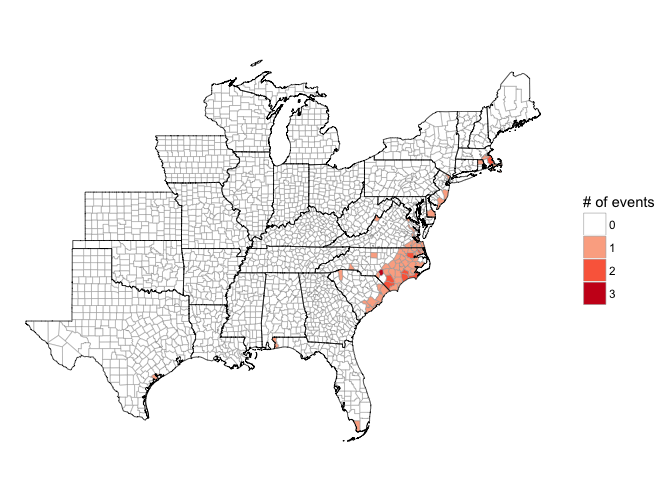
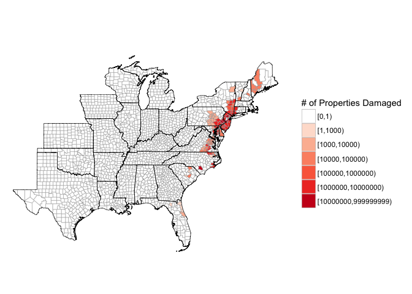

<!-- README.md is generated from README.Rmd. Please edit that file -->
Loading the package
-------------------

The package currently exists in [a development version](https://github.com/zailchen/noaastormevents) on GitHub. You can use the following code to load it:

``` r
library(devtools)
install_github("zailchen/noaastormevents")
library(noaastormevents)
```

As a caveat, however, this package is in early development and relies on other packages that are in development on GitHub, so it may take some doing to get the package set up at the moment.

Overview of package
-------------------

This package can be used to explore and map data from [NOAA's Storm Events Database](https://www.ncdc.noaa.gov/stormevents/). \[More about this database.\]

The storm has a number of functions for creating dataframes of subsets of events from this database or mapping those subsets of events. For example, the `map_events` function allows you to map all events in the database with a starting date within a specified range. The following table lists all the key functions for this package.

| Function                 | Description                                               |
|:-------------------------|:----------------------------------------------------------|
| `find_events`            | Create a dataframe of storm events                        |
| `find_direct_deaths`     | Create a dataframe of direct deaths from storm events     |
| `find_direct_injuries`   | Create a dataframe of direct injuries from storm events   |
| `find_indirect_deaths`   | Create a dataframe of indirect deaths from storm events   |
| `find_indirect_injuries` | Create a dataframe of indirect injuries from storm events |
| `find_damage_property`   | Create a dataframe of property damage from storm events   |
| `find_damage_crops`      | Create a dataframe of crop damage from storm events       |
| `map_events`             | Map storm events                                          |
| `map_direct_deaths`      | Map direct deaths from storm events                       |
| `map_direct_injuries`    | Map direct injuries from storm events                     |
| `map_indirect_deaths`    | Map indirect deaths from storm events                     |
| `map_indirect_injuries`  | Map indirect injuries from storm events                   |
| `map_damage_property`    | Map property damage from storm events                     |
| `map_damage_crops`       | Map crop damage from storm events                         |

All of these functions require you to specify a subset of the Storm Database to use. This subsetting can be done by:

-   Specifying a range of dates
-   Specifying a specific Atlantic tropical storm, in which case the function will identify events near in time and space to the storm's track (this functionality currently works for storms from 1988 to 2015)

At least one of these two methods must be used to specify events to pull. In addition, the user can further filter events to one or a few event types.

Here is a list of some of the dozen most common event types in 1999 within the Storm Events data. For more on event type definitions, see NOAA's documentation on this database \[link to NOAA documentation\].

| Event type        | Number of events in 1999 |
|:------------------|:-------------------------|
| Thunderstorm Wind | 10,347                   |
| Hail              | 10,146                   |
| Drought           | 2,542                    |
| Winter Storm      | 2,533                    |
| Flash Flood       | 2,495                    |
| Heat              | 1,819                    |
| High Wind         | 1,653                    |
| Heavy Snow        | 1,534                    |
| Tornado           | 1,520                    |
| Flood             | 1,518                    |
| Winter Weather    | 1,099                    |
| Lightning         | 862                      |

Here is a list of all events listed in 1999, in order of frequency:

<table>
<colgroup>
<col width="100%" />
</colgroup>
<thead>
<tr class="header">
<th align="center">Event type</th>
</tr>
</thead>
<tbody>
<tr class="odd">
<td align="center">Thunderstorm Wind, Hail, Drought, Winter Storm, Flash Flood, Heat, High Wind, Heavy Snow, Tornado, Flood, Winter Weather, Lightning, Strong Wind, Heavy Rain, Dense Fog, Ice Storm, Cold/Wind Chill, Funnel Cloud, Wildfire, Waterspout, Hurricane (Typhoon), Blizzard, High Surf, Coastal Flood, Tropical Storm, Sleet, Rip Current, Lake-Effect Snow, Storm Surge/Tide, Frost/Freeze, Dust Devil, Freezing Fog, Volcanic Ash, Dust Storm, Marine High Wind, Seiche</td>
</tr>
</tbody>
</table>

If the user runs one of the `find_*` functions, the output is a dataframe of all matching events. This dataframe includes information about the location of the event (state, county name or other location specifier) as well as information on the beginning and ending dates of the event. The `map_*` functions directly create a map of the specified subset of events.

Simple example
--------------

Here are some examples of using the package:

Mapping all counties that had at least one event over a date range:

``` r
map_events(date_range = c("1999-09-14", "1999-09-18"))
```



Creating a dataframe of all events within a date range:

``` r
oct_1999_events <- find_events(date_range = c("1999-09-14", "1999-09-18"))
head(oct_1999_events)
#> # A tibble: 6 × 7
#>   begin_date   end_date         STATE CZ_TYPE        state_county_name
#>       <date>     <date>         <chr>   <chr>                    <chr>
#> 1 1999-09-16 1999-09-17 MASSACHUSETTS       C   massachusetts franklin
#> 2 1999-09-16 1999-09-17 MASSACHUSETTS       C massachusetts barnstable
#> 3 1999-09-16 1999-09-17 MASSACHUSETTS       C  massachusetts hampshire
#> 4 1999-09-17 1999-09-17   PUERTO RICO       C        puerto rico ponce
#> 5 1999-09-18 1999-09-18       FLORIDA       C          florida manatee
#> 6 1999-09-16 1999-09-16      MARYLAND       C         maryland harford
#> # ... with 2 more variables: type <chr>, fips <chr>
```

Creating a dataframe of all events within a certain time and distance from a hurricane track:

``` r
floyd_events <- find_events(storm = "Floyd-1999", dist_limit = 200)
head(floyd_events)
#> # A tibble: 6 × 7
#>   begin_date   end_date         STATE CZ_TYPE           state_county_name
#>       <date>     <date>         <chr>   <chr>                       <chr>
#> 1 1999-09-16 1999-09-17 MASSACHUSETTS       C      massachusetts franklin
#> 2 1999-09-16 1999-09-17 MASSACHUSETTS       C    massachusetts barnstable
#> 3 1999-09-16 1999-09-17 MASSACHUSETTS       C     massachusetts hampshire
#> 4 1999-09-16 1999-09-16      MARYLAND       C            maryland harford
#> 5 1999-09-16 1999-09-16      MARYLAND       C          maryland baltimore
#> 6 1999-09-16 1999-09-16      MARYLAND       C maryland baltimore city (c)
#> # ... with 2 more variables: type <chr>, fips <chr>
```

Here is an example summary of this data:

``` r
floyd_events %>%
  group_by(type) %>%
  summarize(n = n()) %>%
  arrange(desc(n)) %>%
  knitr::kable(colnames = c("Event type", "Number of events"),
               caption = "NOAA Storm Events within 200 km and [x] days of Hurricane Floyd.")
```

| type                |    n|
|:--------------------|----:|
| Flash Flood         |  207|
| High Wind           |  111|
| Hurricane (Typhoon) |   75|
| Heavy Rain          |   26|
| Strong Wind         |   21|
| Tornado             |   17|
| Tropical Storm      |   16|
| Flood               |   11|
| Coastal Flood       |   10|
| Storm Surge/Tide    |    5|
| Funnel Cloud        |    2|
| Thunderstorm Wind   |    2|
| Waterspout          |    1|

Here is another example summary:

``` r
floyd_events %>%
  group_by(fips) %>%
  summarize(n = n(),
            events = paste(type, collapse = ", ")) %>%
  arrange(desc(n)) %>%
  slice(1:10) %>%
  knitr::kable()
```

| fips  |    n| events                                                                                          |
|:------|----:|:------------------------------------------------------------------------------------------------|
| 37137 |    8| Flash Flood, Tornado, Tornado, Funnel Cloud, Tornado, Tornado, Flash Flood, Hurricane (Typhoon) |
| 09003 |    7| Flash Flood, Flash Flood, Heavy Rain, Flash Flood, Strong Wind, Flood, Flood                    |
| 37031 |    7| Flash Flood, Tornado, Tornado, Flash Flood, Tornado, Thunderstorm Wind, Hurricane (Typhoon)     |
| 37133 |    5| Flash Flood, Flash Flood, Funnel Cloud, Tornado, Hurricane (Typhoon)                            |
| 25013 |    4| Heavy Rain, High Wind, Flood, High Wind                                                         |
| 25017 |    4| Heavy Rain, Flash Flood, High Wind, Strong Wind                                                 |
| 25023 |    4| Heavy Rain, High Wind, Strong Wind, Strong Wind                                                 |
| 34001 |    4| Heavy Rain, Hurricane (Typhoon), Tropical Storm, High Wind                                      |
| 34009 |    4| Heavy Rain, Hurricane (Typhoon), Tropical Storm, High Wind                                      |
| 34029 |    4| Flash Flood, Hurricane (Typhoon), Tropical Storm, High Wind                                     |

Mapping any county with at least one tropical storm-related event, not restricting to only the eastern half of the country:

``` r
map_events(storm = "Floyd-1999", dist_limit = 200,
           east_only = FALSE, ts_only = TRUE)
#> Error in map_events(storm = "Floyd-1999", dist_limit = 200, east_only = FALSE, : unused argument (ts_only = TRUE)
```

Mapping the number of events in each county within a certain date range:

``` r
map_events(storm = "Floyd-1999", dist_limit = 200,
           plot_type = "number of events")
```


Mapping the number of events, but only counting counties that were within 100 kilometers of the track of Hurricane Floyd in 1999, with the hurricane's track added to the plot:

``` r
map_events(storm = "Floyd-1999", dist_limit = 100, 
           add_tracks = TRUE, plot_type = "number of events")
```


Mapping the number of all events that happened under the influence of Hurricane Floyd in 1999, with the hurricane's track added to the plot::

``` r
map_events(storm = "Floyd-1999", dist_limit = 100, add_tracks = TRUE,
           plot_type = "number of events")
```


Pulling and mapping other values
--------------------------------

### Damage

-   Property damage
-   Crop damage

``` r
floyd_prop_damage <- find_damage_property(storm = "Floyd-1999",
                                         dist_limit = 500)
floyd_prop_damage %>%
  select(type, fips, damage_property) %>%
  filter(!is.na(damage_property))
#> # A tibble: 125 × 3
#>                 type  fips damage_property
#>                <chr> <chr>           <dbl>
#> 1         Waterspout 12081           0e+00
#> 2        Flash Flood 24025           2e+06
#> 3        Flash Flood 24005           1e+03
#> 4        Flash Flood 24510           5e+03
#> 5        Flash Flood 24009           5e+04
#> 6        Flash Flood 24003           2e+06
#> 7        Flash Flood 24037           5e+04
#> 8        Flash Flood 50025           3e+04
#> 9  Thunderstorm Wind 12031           2e+02
#> 10 Thunderstorm Wind 12109           2e+02
#> # ... with 115 more rows

floyd_prop_damage %>%
  select(type, fips, damage_property) %>%
  filter(!is.na(damage_property)) %>%
  group_by(type) %>%
  summarize(n = n(),
            mean_prop_damage = mean(damage_property)) %>%
  arrange(desc(mean_prop_damage))
#> # A tibble: 5 × 3
#>                type     n mean_prop_damage
#>               <chr> <int>            <dbl>
#> 1        Heavy Rain     3      7000000.000
#> 2       Flash Flood   107      2826359.813
#> 3           Tornado     4      2503175.000
#> 4 Thunderstorm Wind     9         4533.333
#> 5        Waterspout     2            0.000
```

Here is a histogram of reported county-level property damage associated with Hurricane Floyd:

``` r
ggplot(floyd_prop_damage, aes(x = damage_property)) + 
  geom_histogram() + 
  scale_x_log10(label = dollar) + 
  xlab("Property damage") + 
  ylab("# of counties") + 
  theme_bw()
```


Here is a map of property damage associated with Floyd:

``` r
map_damage_property(storm = "Floyd-1999", dist = 500)
```



Here are the counties with the most property damage in terms of cost:

``` r
floyd_prop_damage %>%
  filter(damage_property == max(damage_property, na.rm = TRUE))
#> # A tibble: 1 × 8
#>   begin_date   end_date      STATE CZ_TYPE state_county_name        type
#>       <date>     <date>      <chr>   <chr>             <chr>       <chr>
#> 1 1999-09-16 1999-09-18 NEW JERSEY       C new jersey mercer Flash Flood
#> # ... with 2 more variables: fips <chr>, damage_property <dbl>
colnames(floyd_prop_damage)
#> [1] "begin_date"        "end_date"          "STATE"            
#> [4] "CZ_TYPE"           "state_county_name" "type"             
#> [7] "fips"              "damage_property"
floyd_prop_damage %>%
  group_by(state_county_name) %>%
  summarize(damage_property = sum(damage_property),
            fips = first(fips),
            CZ_TYPE = first(CZ_TYPE), type = first(type)) %>%
  arrange(desc(damage_property)) %>%
  select(state_county_name, CZ_TYPE, type, damage_property, fips) %>%
  slice(1:10)
#> # A tibble: 10 × 5
#>                state_county_name CZ_TYPE        type damage_property  fips
#>                            <chr>   <chr>       <chr>           <dbl> <chr>
#> 1              new jersey bergen       C Flash Flood         1.7e+07 34003
#> 2               new jersey essex       C Flash Flood         7.0e+06 34013
#> 3           new york westchester       C Flash Flood         6.0e+06 36119
#> 4          maryland queen anne's       C Flash Flood         4.0e+06 24035
#> 5               new jersey union       C Flash Flood         4.0e+06 34039
#> 6              new york rockland       C Flash Flood         4.0e+06 36087
#> 7          virginia chesterfield       C Flash Flood         3.0e+06 51041
#> 8          connecticut fairfield       C Flash Flood         1.0e+06 09001
#> 9  virginia colonial heights (c)       C Flash Flood         1.0e+06 51570
#> 10          virginia greensville       C Flash Flood         1.0e+06 51081
```

Some of the multiple counts for a county have the same property damage value:

``` r
floyd_prop_damage %>%
  filter(!is.na(damage_property)) %>%
  group_by(state_county_name) %>%
  mutate(n = n()) %>%
  filter(n > 1) %>%
  select(type, damage_property) %>%
  slice(1:5)
#> Adding missing grouping variables: `state_county_name`
#> Source: local data frame [11 x 3]
#> Groups: state_county_name [5]
#> 
#>     state_county_name              type damage_property
#>                 <chr>             <chr>           <dbl>
#> 1       florida duval Thunderstorm Wind             200
#> 2       florida duval Thunderstorm Wind             200
#> 3   florida st. johns Thunderstorm Wind             200
#> 4   florida st. johns Thunderstorm Wind             300
#> 5   florida st. johns Thunderstorm Wind             300
#> 6   new york dutchess       Flash Flood           90000
#> 7   new york dutchess       Flash Flood           10000
#> 8  new york schoharie       Flash Flood           85000
#> 9  new york schoharie       Flash Flood            5000
#> 10    new york ulster       Flash Flood           97500
#> 11    new york ulster       Flash Flood           10000
```

It looks like some events are given by day. For example, for Duval County, FL, it looks like there are separate events for Sept. 14 and Sept. 15 for "Thunderstorm Wind". We may want to make sure that it makes sense to add these county-level values together to get a county total for damage.

``` r
floyd_prop_damage %>%
  filter(state_county_name == "florida duval") %>%
  as.data.frame()
#>   begin_date   end_date   STATE CZ_TYPE state_county_name
#> 1 1999-09-15 1999-09-15 FLORIDA       Z     florida duval
#> 2 1999-09-14 1999-09-14 FLORIDA       C     florida duval
#> 3 1999-09-15 1999-09-15 FLORIDA       C     florida duval
#>                  type  fips damage_property
#> 1 Hurricane (Typhoon) 12031              NA
#> 2   Thunderstorm Wind 12031             200
#> 3   Thunderstorm Wind 12031             200
```

In other counties (e.g., Litchfield County, CT), it looks like there is a repeat listing (both listings for "High Wind" cover the same two days and have the same property damage values). In this case, should we only include one of these two listings in determining total property damage?

``` r
floyd_prop_damage %>%
  filter(state_county_name == "connecticut litchfield") %>%
  as.data.frame()
#>   begin_date   end_date       STATE CZ_TYPE      state_county_name
#> 1 1999-09-16 1999-09-17 CONNECTICUT       Z connecticut litchfield
#> 2 1999-09-16 1999-09-17 CONNECTICUT       Z connecticut litchfield
#> 3 1999-09-16 1999-09-17 CONNECTICUT       C connecticut litchfield
#>          type  fips damage_property
#> 1   High Wind 09005              NA
#> 2   High Wind 09005              NA
#> 3 Flash Flood 09005           1e+06
```

### Injuries

-   Direct injuries
-   Indirect injuries

### Deaths

-   Direct deaths
-   Indirect deaths

Details of how the package works
--------------------------------

This package pulls data posted online by the National Centers for Environmental Information (NCEI; formally, the National Climatic Data Center \[NCDC\]). The NCEI currently includes comma-separated files covering different elements of the Storm Events database, with separate files for each year, which are available [here](http://www1.ncdc.noaa.gov/pub/data/swdi/stormevents/csvfiles/).

For each year, there are three file types:

-   `"details"`
-   `"fatalities"`
-   `"locations"`

The file names all follow a consistent format (anything in square brackets is replaced by its value in each file name):

    StormEvents_[file type]-ftp_v[version number]_d[storm year]_c[date file created].csv.gz

More details on these file naming conventions are available from NCEI through a [README file](http://www1.ncdc.noaa.gov/pub/data/swdi/stormevents/csvfiles/README).

Because these file names include the date the file was created, these file names can change with time, and we don't know *a priori* what the name of the file for each year will be. However, if we have a list of available file names, it is possible to determine which corresponds to which year, by matching the year of data you'd like to the year within the `_d[storm year]_` part of the file name.

One function in the `noaastormevents` package, `find_file_name`, uses the `readHTMLTable` function from the `XML` package to read all the file names from the online repository of files and, from this list, identify the appropriate file for the year requested. For example, to determine the "details" file name for 1999, you can run:

``` r
find_file_name(year = 1999)
#> [1] "StormEvents_details-ftp_v1.0_d1999_c20160223.csv.gz"
```

While the default is to find the name of the "details" file type for a year, you can also use the `file_type` argument to pull any of the three file types. For example, to find out the name of the "fatalities" file for 1999, you could run:

``` r
find_file_name(year = 1999, file_type = "fatalities")
#> [1] "StormEvents_fatalities-ftp_v1.0_d1999_c20160223.csv.gz"
```

Files are compressed using gzip compression.
