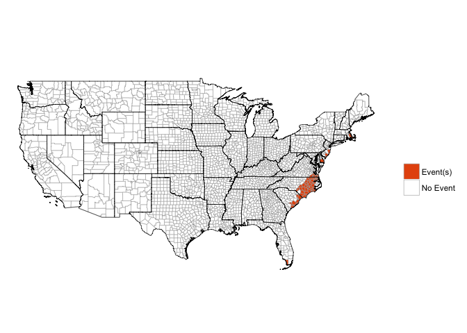

[](https://travis-ci.org/zailchen/noaastormevents)

<!-- README.md is generated from README.Rmd. Please edit that file -->
Loading the package
-------------------

The package currently exists in [a development version](https://github.com/zailchen/noaastormevents) on GitHub. You can use the following code to load it:

``` r
library(devtools)
install_github("zailchen/noaastormevents")
library(noaastormevents)
```

``` r
library(hurricaneexposuredata)
library(lubridate)
library(tidyverse)
library(ggplot2)
library(scales)
```

As a caveat, however, this package is in early development and relies on other packages that are in development on GitHub, so it may take some doing to get the package set up at the moment.

Overview of package
-------------------

This package can be used to explore and map data from [NOAA's Storm Events Database](https://www.ncdc.noaa.gov/stormevents/). \[More about this database.\]

The storm has a number of functions for creating dataframes of subsets of events from this database or mapping those subsets of events. For example, the `map_events` function allows you to map all events in the database with a starting date within a specified range. The following table lists all the key functions for this package.

| Function                 | Description                                               |
|:-------------------------|:----------------------------------------------------------|
| `find_events`            | Create a dataframe of storm events                        |
| `find_direct_deaths`     | Create a dataframe of direct deaths from storm events     |
| `find_direct_injuries`   | Create a dataframe of direct injuries from storm events   |
| `find_indirect_deaths`   | Create a dataframe of indirect deaths from storm events   |
| `find_indirect_injuries` | Create a dataframe of indirect injuries from storm events |
| `find_damage_property`   | Create a dataframe of property damage from storm events   |
| `find_damage_crops`      | Create a dataframe of crop damage from storm events       |
| `map_events`             | Map storm events                                          |
| `map_direct_deaths`      | Map direct deaths from storm events                       |
| `map_direct_injuries`    | Map direct injuries from storm events                     |
| `map_indirect_deaths`    | Map indirect deaths from storm events                     |
| `map_indirect_injuries`  | Map indirect injuries from storm events                   |
| `map_damage_property`    | Map property damage from storm events                     |
| `map_damage_crops`       | Map crop damage from storm events                         |

All of these functions require you to specify a subset of the Storm Database to use. This subsetting can be done by:

-   Specifying a range of dates
-   Specifying a specific Atlantic tropical storm, in which case the function will identify events near in time and space to the storm's track (this functionality currently works for storms from 1988 to 2015)

At least one of these two methods must be used to specify events to pull. In addition, the user can further filter events to one or a few event types. Here is a list of all events listed in 1999, in order of frequency:

<table>
<colgroup>
<col width="100%" />
</colgroup>
<thead>
<tr class="header">
<th align="center">Event type</th>
</tr>
</thead>
<tbody>
<tr class="odd">
<td align="center">Thunderstorm Wind, Hail, Drought, Winter Storm, Flash Flood, Heat, High Wind, Heavy Snow, Tornado, Flood, Winter Weather, Lightning, Strong Wind, Heavy Rain, Dense Fog, Ice Storm, Cold/Wind Chill, Funnel Cloud, Wildfire, Waterspout, Hurricane (Typhoon), Blizzard, High Surf, Coastal Flood, Tropical Storm, Sleet, Rip Current, Lake-Effect Snow, Storm Surge/Tide, Frost/Freeze, Dust Devil, Freezing Fog, Volcanic Ash, Dust Storm, Marine High Wind, Seiche</td>
</tr>
</tbody>
</table>

For more on event type definitions, see NOAA's documentation on this database \[link to NOAA documentation\].

If the user runs one of the `find_*` functions, the output is a dataframe of all matching events. This dataframe includes information about the location of the event (state, county name or other location specifier) as well as information on the beginning and ending dates of the event. The `map_*` functions directly create a map of the specified subset of events.

Simple example
--------------

Here are some examples of using the package:

Mapping all counties that had at least one event over a date range:

``` r
map_events(date_range = c("1999-09-14", "1999-09-18"))
#> Warning: `panel.margin` is deprecated. Please use `panel.spacing` property
#> instead
```



Creating a dataframe of all events within a date range:

``` r
oct_1999_events <- find_events(date_range = c("1999-09-14", "1999-09-18"))
head(oct_1999_events)
#> # A tibble: 6 × 8
#>   begin_date   end_date state_county_name   state cz_type
#>       <date>     <date>             <chr>   <chr>   <chr>
#> 1 1999-09-14 1999-09-14     florida duval Florida       C
#> 2 1999-09-14 1999-09-14 florida st. johns Florida       C
#> 3 1999-09-14 1999-09-14  arizona maricopa Arizona       C
#> 4 1999-09-14 1999-09-14  arizona maricopa Arizona       C
#> 5 1999-09-14 1999-09-14     arizona pinal Arizona       C
#> 6 1999-09-14 1999-09-14  arizona maricopa Arizona       C
#> # ... with 3 more variables: type <chr>, fips <chr>, source <chr>
```

Creating a dataframe of all events within a certain time and distance from a hurricane track:

``` r
floyd_events <- find_events(storm = "Floyd-1999", dist_limit = 200)
head(floyd_events)
#> # A tibble: 6 × 9
#>   begin_date   end_date      state_county_name          state cz_type
#>       <date>     <date>                  <chr>          <chr>   <chr>
#> 1 1999-09-14 1999-09-14  north carolina martin North Carolina       C
#> 2 1999-09-14 1999-09-16  north carolina greene North Carolina       Z
#> 3 1999-09-14 1999-09-16  north carolina onslow North Carolina       Z
#> 4 1999-09-14 1999-09-16 north carolina pamlico North Carolina       Z
#> 5 1999-09-14 1999-09-16    north carolina pitt North Carolina       Z
#> 6 1999-09-14 1999-09-16 north carolina tyrrell North Carolina       Z
#> # ... with 4 more variables: type <chr>, fips <chr>, source <chr>,
#> #   storm_id <chr>
```

Here is an example summary of this data:

``` r
floyd_events %>%
  group_by(type) %>%
  summarize(n = n()) %>%
  arrange(desc(n)) %>%
  knitr::kable(colnames = c("Event type", "Number of events"),
               caption = "NOAA Storm Events within 200 km and [x] days of Hurricane Floyd.")
```

| type                |    n|
|:--------------------|----:|
| Flash Flood         |  207|
| High Wind           |  111|
| Hurricane (Typhoon) |   75|
| Heavy Rain          |   26|
| Strong Wind         |   21|
| Tornado             |   17|
| Tropical Storm      |   16|
| Flood               |   11|
| Coastal Flood       |   10|
| Storm Surge/Tide    |    5|
| Funnel Cloud        |    2|
| Thunderstorm Wind   |    2|
| Waterspout          |    1|

Here is another example summary:

``` r
floyd_events %>%
  group_by(fips) %>%
  summarize(n = n(),
            events = paste(type, collapse = ", ")) %>%
  arrange(desc(n)) %>%
  slice(1:10) %>%
  knitr::kable()
```

| fips  |    n| events                                                                                          |
|:------|----:|:------------------------------------------------------------------------------------------------|
| 37137 |    8| Hurricane (Typhoon), Flash Flood, Tornado, Tornado, Funnel Cloud, Tornado, Tornado, Flash Flood |
| 09003 |    7| Flash Flood, Flash Flood, Heavy Rain, Flash Flood, Strong Wind, Flood, Flood                    |
| 37031 |    7| Hurricane (Typhoon), Flash Flood, Tornado, Tornado, Tornado, Thunderstorm Wind, Flash Flood     |
| 37133 |    5| Hurricane (Typhoon), Flash Flood, Funnel Cloud, Tornado, Flash Flood                            |
| 25013 |    4| Heavy Rain, High Wind, Flood, High Wind                                                         |
| 25017 |    4| Heavy Rain, Flash Flood, High Wind, Strong Wind                                                 |
| 25023 |    4| Heavy Rain, High Wind, Strong Wind, Strong Wind                                                 |
| 34001 |    4| Heavy Rain, Hurricane (Typhoon), Tropical Storm, High Wind                                      |
| 34009 |    4| Heavy Rain, Hurricane (Typhoon), Tropical Storm, High Wind                                      |
| 34029 |    4| Flash Flood, Hurricane (Typhoon), Tropical Storm, High Wind                                     |

Mapping any county with at least one tropical storm-related event, not restricting to only the eastern half of the country:

``` r
map_events(storm = "Floyd-1999", dist_limit = 200,
           east_only = FALSE, ts_only = TRUE)
#> Error in map_events(storm = "Floyd-1999", dist_limit = 200, east_only = FALSE, : unused argument (ts_only = TRUE)
```

Mapping the number of events in each county within a certain date range:

``` r
map_events(storm = "Floyd-1999", dist_limit = 200,
           plot_type = "number of events")
#> Warning: `panel.margin` is deprecated. Please use `panel.spacing` property
#> instead
```


Mapping the number of events, but only counting counties that were within 100 kilometers of the track of Hurricane Floyd in 1999, with the hurricane's track added to the plot:

``` r
map_events(storm = "Floyd-1999", dist_limit = 100, 
           add_tracks = TRUE, plot_type = "number of events")
#> Warning: `panel.margin` is deprecated. Please use `panel.spacing` property
#> instead
```


Mapping the number of all events that happened under the influence of Hurricane Floyd in 1999, with the hurricane's track added to the plot::

``` r
map_events(storm = "Floyd-1999", dist_limit = 100, add_tracks = TRUE,
           plot_type = "number of events")
#> Warning: `panel.margin` is deprecated. Please use `panel.spacing` property
#> instead
```


Pulling and mapping other values
--------------------------------

### Damage

-   Property damage
-   Crop damage

``` r
floyd_prop_damage <- find_damage_property(storm = "Floyd-1999",
                                         dist_limit = 500)
#> Error in eval(expr, envir, enclos): object 'episode_id' not found
floyd_prop_damage %>%
  select(type, fips, damage_property) %>%
  filter(!is.na(damage_property))
#> Error in eval(expr, envir, enclos): object 'floyd_prop_damage' not found

floyd_prop_damage %>%
  select(type, fips, damage_property) %>%
  filter(!is.na(damage_property)) %>%
  group_by(type) %>%
  summarize(n = n(),
            mean_prop_damage = mean(damage_property)) %>%
  arrange(desc(mean_prop_damage))
#> Error in eval(expr, envir, enclos): object 'floyd_prop_damage' not found
```

Here is a histogram of reported county-level property damage associated with Hurricane Floyd:

``` r
ggplot(floyd_prop_damage, aes(x = damage_property)) + 
  geom_histogram() + 
  scale_x_log10(label = dollar) + 
  xlab("Property damage") + 
  ylab("# of counties") + 
  theme_bw()
#> Error in ggplot(floyd_prop_damage, aes(x = damage_property)): object 'floyd_prop_damage' not found
```

Here is a map of property damage associated with Floyd:

``` r
map_damage_property(storm = "Floyd-1999", dist = 500)
#> Error in eval(expr, envir, enclos): object 'episode_id' not found
```

Here are the counties with the most property damage in terms of cost:

``` r
floyd_prop_damage %>%
  filter(damage_property == max(damage_property, na.rm = TRUE))
#> Error in eval(expr, envir, enclos): object 'floyd_prop_damage' not found
colnames(floyd_prop_damage)
#> Error in is.data.frame(x): object 'floyd_prop_damage' not found
floyd_prop_damage %>%
  group_by(state_county_name) %>%
  summarize(damage_property = sum(damage_property),
            fips = first(fips),
            CZ_TYPE = first(CZ_TYPE), type = first(type)) %>%
  arrange(desc(damage_property)) %>%
  select(state_county_name, CZ_TYPE, type, damage_property, fips) %>%
  slice(1:10)
#> Error in eval(expr, envir, enclos): object 'floyd_prop_damage' not found
```

Some of the multiple counts for a county have the same property damage value:

``` r
floyd_prop_damage %>%
  filter(!is.na(damage_property)) %>%
  group_by(state_county_name) %>%
  mutate(n = n()) %>%
  filter(n > 1) %>%
  select(type, damage_property) %>%
  slice(1:5)
#> Error in eval(expr, envir, enclos): object 'floyd_prop_damage' not found
```

It looks like some events are given by day. For example, for Duval County, FL, it looks like there are separate events for Sept. 14 and Sept. 15 for "Thunderstorm Wind". We may want to make sure that it makes sense to add these county-level values together to get a county total for damage.

``` r
floyd_prop_damage %>%
  filter(state_county_name == "florida duval") %>%
  as.data.frame()
#> Error in eval(expr, envir, enclos): object 'floyd_prop_damage' not found
```

In other counties (e.g., Litchfield County, CT), it looks like there is a repeat listing (both listings for "High Wind" cover the same two days and have the same property damage values). In this case, should we only include one of these two listings in determining total property damage?

``` r
floyd_prop_damage %>%
  filter(state_county_name == "connecticut litchfield") %>%
  as.data.frame()
#> Error in eval(expr, envir, enclos): object 'floyd_prop_damage' not found
```

### Injuries

-   Direct injuries
-   Indirect injuries

### Deaths

-   Direct deaths
-   Indirect deaths

Details of how the package works
--------------------------------

This package pulls data posted online by the National Centers for Environmental Information (NCEI; formally, the National Climatic Data Center \[NCDC\]). The NCEI currently includes comma-separated files covering different elements of the Storm Events database, with separate files for each year, which are available [here](http://www1.ncdc.noaa.gov/pub/data/swdi/stormevents/csvfiles/).

For each year, there are three file types:

-   `"details"`
-   `"fatalities"`
-   `"locations"`

The file names all follow a consistent format (anything in square brackets is replaced by its value in each file name):

    StormEvents_[file type]-ftp_v[version number]_d[storm year]_c[date file created].csv.gz

More details on these file naming conventions are available from NCEI through a [README file](http://www1.ncdc.noaa.gov/pub/data/swdi/stormevents/csvfiles/README).

Because these file names include the date the file was created, these file names can change with time, and we don't know *a priori* what the name of the file for each year will be. However, if we have a list of available file names, it is possible to determine which corresponds to which year, by matching the year of data you'd like to the year within the `_d[storm year]_` part of the file name.

One function in the `noaastormevents` package, `find_file_name`, uses the `readHTMLTable` function from the `XML` package to read all the file names from the online repository of files and, from this list, identify the appropriate file for the year requested. For example, to determine the "details" file name for 1999, you can run:

``` r
find_file_name(year = 1999)
#> [1] "StormEvents_details-ftp_v1.0_d1999_c20160223.csv.gz"
```

While the default is to find the name of the "details" file type for a year, you can also use the `file_type` argument to pull any of the three file types. For example, to find out the name of the "fatalities" file for 1999, you could run:

``` r
find_file_name(year = 1999, file_type = "fatalities")
#> [1] "StormEvents_fatalities-ftp_v1.0_d1999_c20160223.csv.gz"
```

Files are compressed using gzip compression.

### Additional data cleaning

The `noaastormevents` package does a bit of additional cleaning once it pulls storm event data.

First, while many storm events are listed by county, with identification by a 5-digit Federal Information Processing Standard (FIPS) code, some events are instead listed by a forecast zone identifier. In the original data, these are listed with the value "Z" for the `CZ_TYPE` variable. In 1999, about 35% of listed storm events were listed by forecast zone rather than county:

``` r
all_1999_events %>% group_by(CZ_TYPE) %>% summarize(frequency = n())
#> Error in eval(expr, envir, enclos): unknown variable to group by : CZ_TYPE
```

\[double check-- is this after filtering out some of the forecast zone observations?\]

When the package pulls storm events, any that are identified based on a county FIPS code are directly linked to a single county with the code. For storm events identified by forecast zone, the package tries to match it to the correct county. It takes the following steps to try to do that:

\[Steps for trying to match up forecast zone events to counties\]
